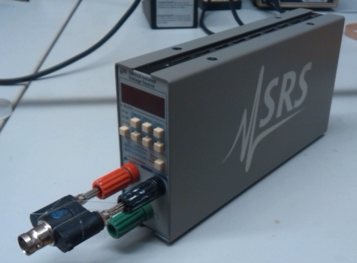
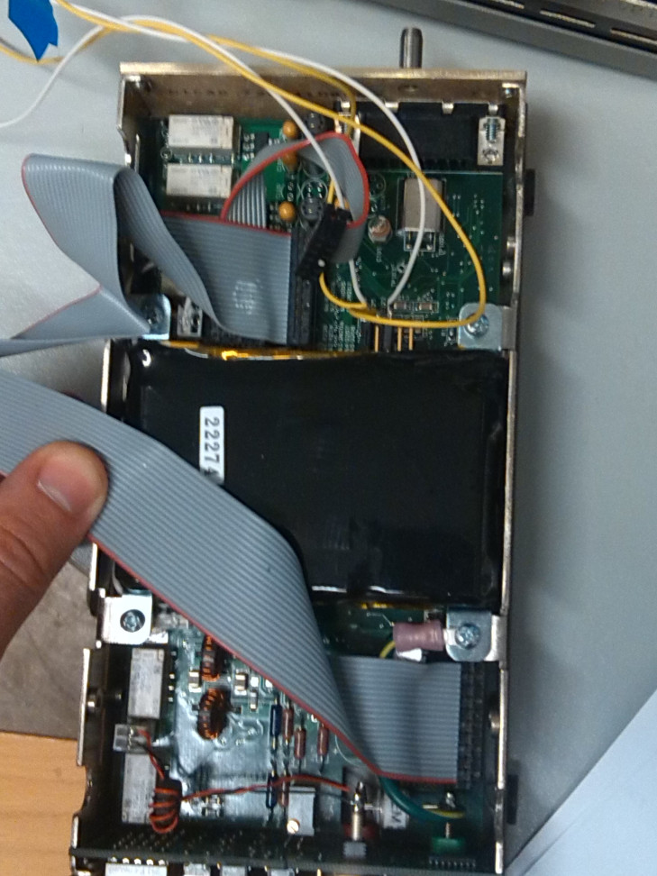
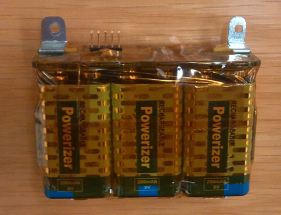
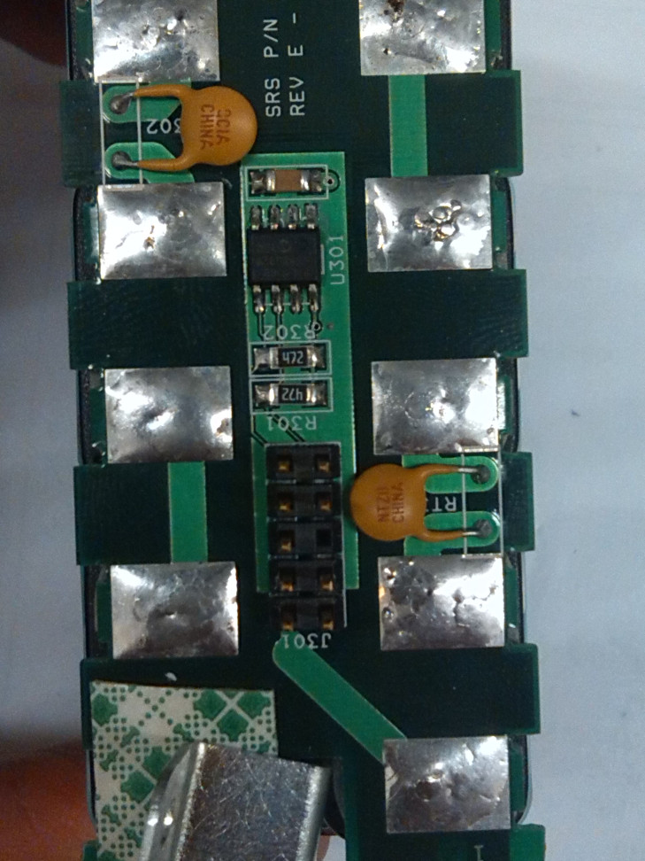
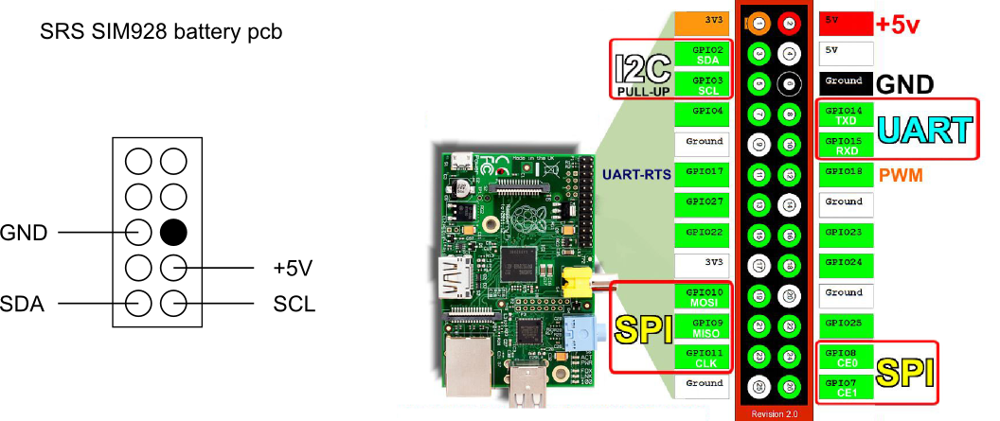

====================================
SRS SIM928 battery replacement guide
====================================

.. Written by F. Forster

   Picture of the SRS SIM928.

Note
----
This guide was written in rst and might be converted to another file format via pandoc. Thus, the output is most likely not perfect. Please read the `rst version`_ for best reading experience. Last updated 5.2.2014.

.. _rst version: doc.rst

Introduction
------------
The SRS SIM928 is a battery powered DC voltage source. The batteries' purpose is to provide voltage free of noise from the power line. Therefore, the SIM module has two sets of batteries A and B where one is used while the other one is charged. These batteries have a limited lifetime and can only be recharged around 500 times before the capacity degrades. The amount of charge cycles is monitored and a status indicator will show when the batteries have to be replaced. While the SIM928 itself is quite cheap compared to other voltage sources, the costs of constantly replacing the batteries usually once a year are around 350$ if ordered from SRS directly. Considered that we have more than 10 devices in our lab, this would be a large amount of money spent every year. This guide explains how to replace a battery without much effort with costs of around 60$ per battery thus cutting the costs to 20%.

Stuff required for one battery:

- An old SIM928 battery pack
- Six 9V NiMH rechargeable batteries, 200 mAh capacity recommended

Suggested equipment:

- Raspberry Pi
- Four wires with pin connectors to connect the I2C port of the raspberry with the one of the battery pack

   The opened case of the SIM928 with the battery (black with serial number printed on it) visible.

The battery
-----------

   The battery pack of the SIM SRS928

The battery itself consist of six ordinary 9V NiMH batteries, where three are combined in series to form battery A and B. Actually, only the cheapest batteries are used which costs around 4$ each and can only be charged 500 times. Since replacing the batteries is not really so much fun and it affects ongoing experiments, it is recommended to use better ones which probably cost more but allow 1000 recharges. These batteries are plugged onto a small pcb, which has an EEPROM to store the properties of the battery pack. The replacement of the batteries itself is very simple: Just remove the tape around the batteries, remove the old batteries, replace them with new ones and use some tape to keep them together. Now the battery pack is usable again. However, at this stage the battery replacement indicator will still show that the batteries have to be replaced since it is just a simple counter stored in the EEPROM of the battery which we did not change yet.

Understanding the EEPROM
------------------------

   The pcb of the battery pack. J301 is the connector to access the EEPROM U301.

The EEPROM chip used on the battery board is a Microchip 24LC16B which stores its information in 8 different blocks which contain 256 bytes of data each. However, only the first 3 blocks are used. Each data block has a different I2C bus address. In the first block, the information about the battery pack itself are stored, e.g. the serial number and the  production date. The second block contains the number of charge cycles for each battery. The third block contains only one byte of data the purpose of which is unknown so far. All the data is stored as 16 bit integer (meaning you obtain the number in decimal system bei using two neighbouring bytes, e. g. 0x02 and 0x7b are to be read as 0x027b = 635).

Data block 1

+--------------------+----+----+----+----+----+----+----+----+----+----+----+----+
|Data Adress         |0x00|0x01|0x02|0x03|0x04|0x05|0x06|0x07|0x08|0x09|0x0a|0x0b|
+--------------------+----+----+----+----+----+----+----+----+----+----+----+----+
|Value               |0x02|0x7b|0x57|0x08|0x00|0x07|0x00|0x10|0x07|0xda|0x00|0x01|
+--------------------+----+----+----+----+----+----+----+----+----+----+----+----+
|Human Readable Value|635      |22280    |7        |16       |2010     |1        |
+--------------------+----+----+----+----+----+----+----+----+----+----+----+----+
|Explanation         |PNUM     |SERIAL   |Month    |Day      |Year     |???      |
+--------------------+----+----+----+----+----+----+----+----+----+----+----+----+

+--------------------+----+----+----+----+----+----+----+----+----+----+
|Data Adress         |0x0c|0x0d|0x0e|0x0f|0x10|0x11|0x12|0x13|0x14|0x15|
+--------------------+----+----+----+----+----+----+----+----+----+----+
|Value               |0x00|0x01|0x59|0xd8|0x7c|0x38|0x00|0x9b|0x01|0xf4|
+--------------------+----+----+----+----+----+----+----+----+----+----+
|Human Readable Value|1        |23000    |31800    |155      |500      |
+--------------------+----+----+----+----+----+----+----+----+----+----+
|Explanation         |???      |U_min    |U_max?   |???      |MAX CYC  |
+--------------------+----+----+----+----+----+----+----+----+----+----+

The interesting information we want to change here is the date (bytes 0x06 to 0x09), as well as the charging parameters of the batteries (0x0e to 0x15). The date should resemble the age of the new batteries used since batteries itself degrade overtime even if you don't use them. It is not crucial to change this, since the electronics will simply ignore this anyways - but it is a useful information for the user later on to check when the batteries have been replaced. The charging parameters should be changed accordingly to properties of the new batteries. This is not trivial and very important, since wrong numbers here can either discharge the batteries too far or charge a battery forever while never reaching the nominal charge state.

- 0x00 - 0x09: Pretty much self explanatory. Maybe except for the PNUM. This is the battery part number, a different number would probably mean a a different model. All battery EEPROMs I looked at had the same PNUM. If you find some other value here, you should probably investigate it, but otherwise safe to ignore.
- 0x0a - 0x0d: Unknown! Again, all batteries had these values.
- 0x0e, 0x0f (U_min): Voltage endpoint in mV. The battery charger will discharge a battery to this value before charging it.
- 0x10, 0x11 (U_max?): Probably (!) the voltage in mV at which to stop charging the battery. This is not really clear, since the manual (3.1.2) states charging will terminate either on dV/dt = 0 or after a fixed time. HOWEVER, it was found out that with a different set of batteries charging only stopped after a certain time and the battery was not marked as charged. Lowering this value by 100 solved this problem.
- 0x12, 0x13 (???): Unknown. This is most likely the capacitance in mAh of the batteries, even if the cheap batteries used by SRS have a nominal capicitance of 200 mAh. Maybe the value of 155 is to allow for not completely emptying the batteries. Another indication is that the example calculation in the manual at (3.1.2.1) uses 150 mAh as capacitance. Besides, the manual explicitely claims that the capicitance of the batteries is saved on the EEPROM (3.1.3) and this is the only value which might fit. Most likely it is used to determine the upper limit of the charging time.
- 0x14, 0x15 (MAX CYC): Maximum charging cycles. Even though they claim in the manual that the batteries can be charged for 1000 time, this is definately not the case.

Data block 2

+--------------------+----+----+----+----+----+----+----+----+----+----+----+----+
|Data Adress         |0x00|0x01|0x02|0x03|0x04|0x05|0x06|0x07|0x08|0x09|0x0a|0x0b|
+--------------------+----+----+----+----+----+----+----+----+----+----+----+----+
|Value               |0x14|0x2c|0x04|0xa7|0x04|0xba|0x04|0xae|0x04|0xb0|0x00|0x12|
+--------------------+----+----+----+----+----+----+----+----+----+----+----+----+
|Human Readable Value|5164     |1191     |1210     |1198     |1200     |18       |
+--------------------+----+----+--------------+----+----+----+----+----+----+----+
|Explanation         |???      |Charge related numbers                 |???      |
+--------------------+----+----+--------------+----+----+----+----+----+----+----+

This data block contains information about the batteries.

- 0x00, 0x01: No idea, what it is. It differs for all batteries and changes its value quite often. However, it does not (at least not simply) resemble the number of charges.
- 0x02-0x09: This values relate to the charging of battery A and B. I don't know, why there are four numbers instead of two; maybe it represents the number of battery switches as well as the number of completed charging events.
- 0x0a, 0x0b: Unknown. The values I found were always below 100. Maybe it is some kind of charge state?

Data block 3

+--------------------+----+----+
|Data Adress         |0x00|0x01|
+--------------------+----+----+
|Value               |0x00|0x00|
+--------------------+----+----+
|Human Readable Value|0        |
+--------------------+----+----+
|Explanation         |???      |
+--------------------+----+----+

- 0x00, 0x01: No idea what this is. The block was the same for all batteries investigated. Maybe it is the TRIP condition (True or False) of the battery? I did not want to test this since I did not want to take the risk of destroying the electronics.

Reprogramming the EEPROM
------------------------
Okay, now that we know which information is stored where in the EEPROM, we want to reprogram it. Therefore, we need the Raspberry Pi (or any other tool which can speak the I2C protocol). Since there are tutorials about using the Raspberry Pi to communicate via I2C bus, I will not go into details here. The short version:

- Make sure ``i2c-tools`` is installed on your raspberry.
- Use ``modprobe`` to load the kernel modules ``i2c-bcm2708`` and ``i2c-dev`` and make sure the user is in the ``i2c``-group (or run the i2c commands with ``sudo``; not recommended)
- Connect the four wires from the GPIO pins of the Raspberry Pi to the pins of the battery pcb like shown below.
- Use ``i2cdetect -y 1`` to determine the address of the EEPROM. In my case, it was 0x50 to 0x57 (one address for each data block)

From here on, you can use the provided `bash script`_ by running it in the bash. It asks you for the I2C bus and addresses and provides functionality to conveniently read the EEPROM and write the important information. However, if you want full control on what you are doing, you can use the following.

.. _bash script: eeprom_script.sh

- Verify the data by reading them first via ``i2cget -y 1 <i2c address> <data address>`` and then overwrite them via ``i2cset -y 1 <i2c address> <data address> <new data value>``
- The data in block 1 are to be adjusted as it fits (see description above)
- The charge cycle related data (0x02 to 0x09) should be all resetted to 0x0001, so e. g. data address 0x02 to the value 0x00 and data address 0x03 to data value 0x01

   Wiring scheme of I2C connection.

Trouble shooting
----------------

- The batteries are not indicated as charged even after a long charging time; the output of the instrument does not work
  Lower the value of U_max (Data Block 1, 0x10, 0x11) slightly.
